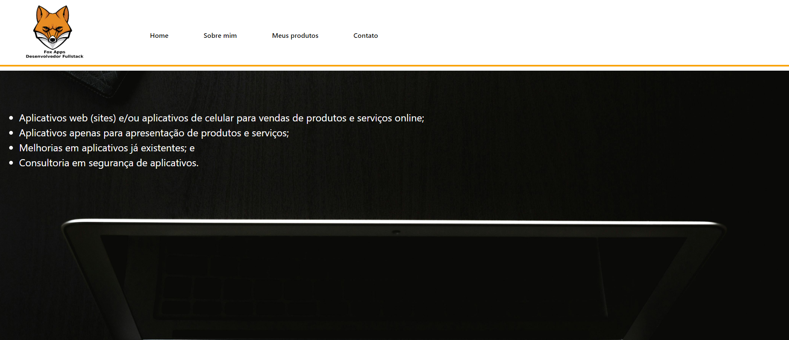
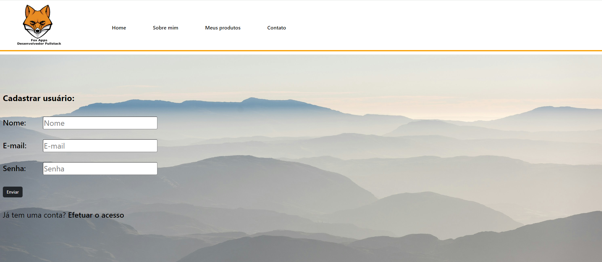
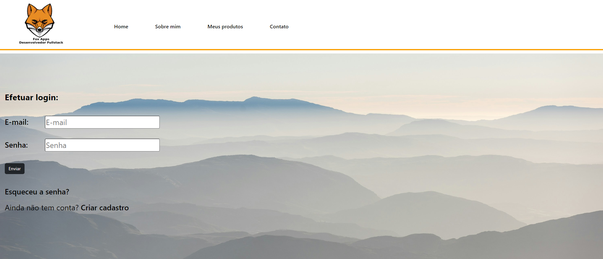
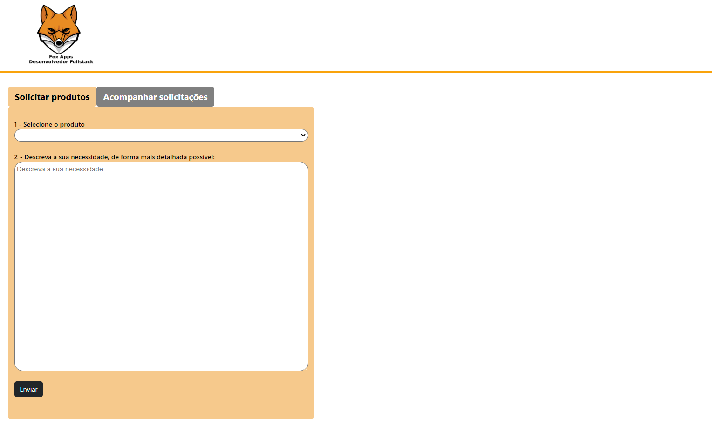
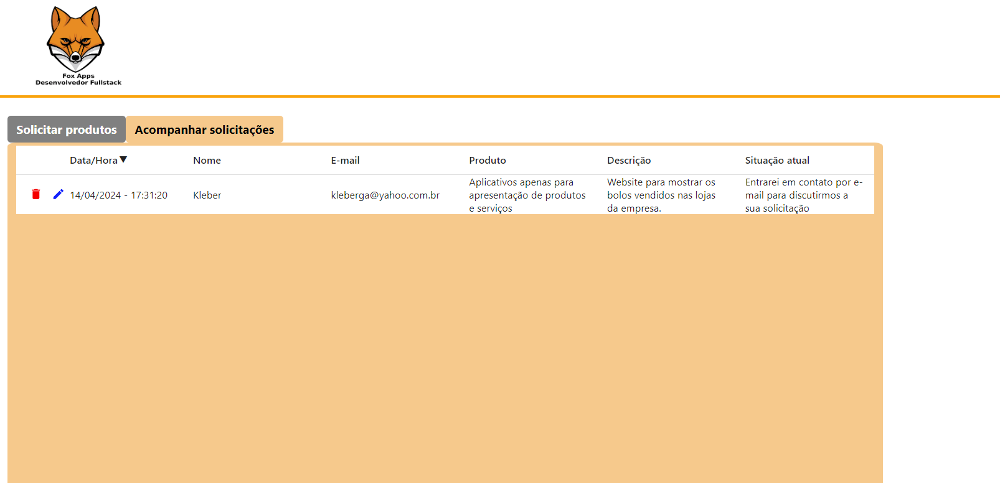

# Aplicação web para desenvolvedor full stack freelancer

Este projeto é um exemplo de aplicação web utilizada para divulgar trabalhos de desenvolvedores full stack freelancer, ou seja, desenvolvedores autônomos.

A aplicação possui quatro páginas principais:

- Home: que possui uma imagem e uma frase vinculadas ao trabalho do desenvolvedor;
- Quem sou: reponsável por apresentar a formação e a experiência do desenvolvedor;
- Meus Produtos: onde constam os tipos de trabalhos que o desenvolvedor faz; e
- Contato: página na qual o usuário pode se registrar (ou efetuar login) e acessar uma área própria para solicitar produtos ou acompanhar o andamento dos seus produtos solicitados. Na área do usuário, o mesmo pode visualizar, editar e excluir os seus pedidos de produtos.

No âmbito técnico, a aplicação possui as seguintes características:
- o projeto foi construído com a biblioteca React, do Javascript, com auxílio do Vite para empacotar o aplicativo e agilizar o seu carregamento durante o desenvolvimento;
- o registro e login são feitos por meio do recurso de login do Google Firebase;
- as solicitações de produtos são salvas no banco de dados Firestores do Firebase;
- os campos de nome, e-mail e senha possuem validações tanto no registro do usuário quanto no login. A solicitação de um produto também possui validações;
- para melhorar o aspecto visual, foram utilizadas imagens de fundo e também botões, ícones e abas de outras bibliotecas compo Bootstrap e Material Icons; e
- o projeto busca utilizar hooks do React, como useState e useEffect.

Abaixo constam imagens da aplicação em funcionamento:

1. Página "Home":

2. Página "Sobre Mim":

3. Página "Meus Produtos":

4. Página "Contato":

5. Página "Registro":

6. Página "Login":

7. Página do cliente - aba "Solicitar":

8. Página do cliente - aba "Acompanhar Solicitações":

